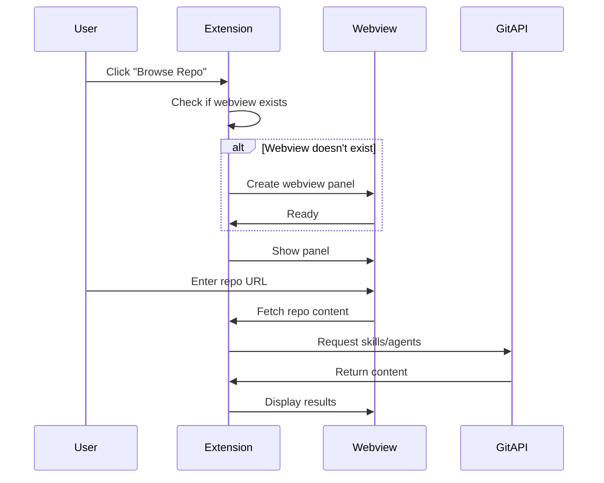
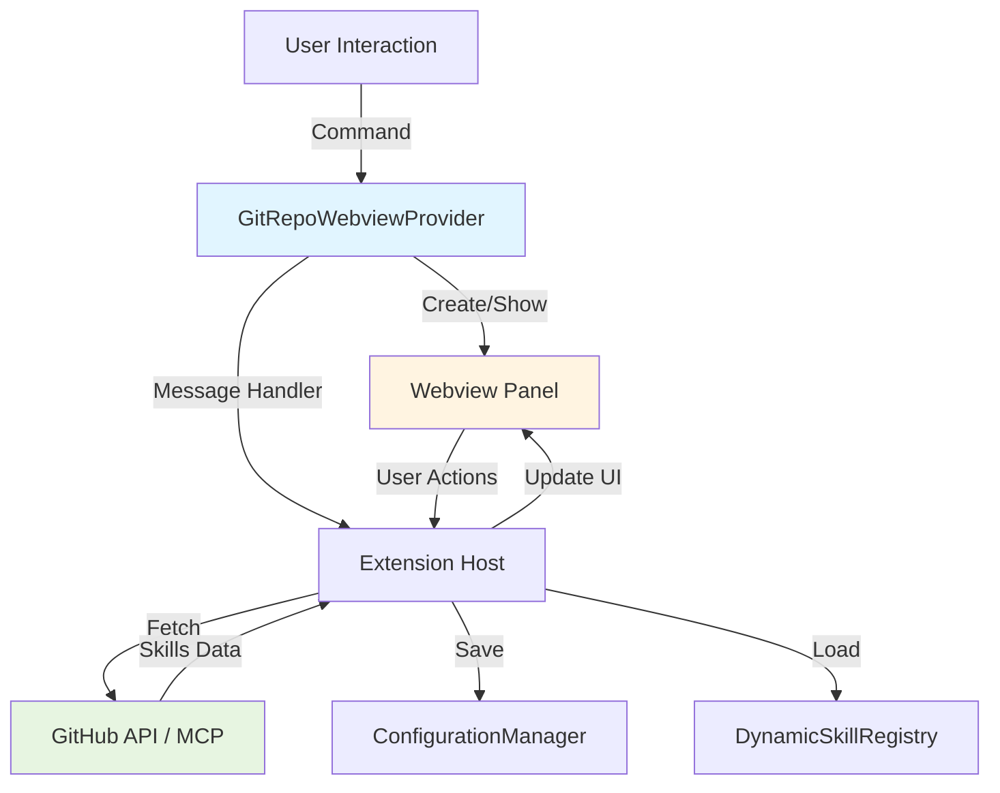
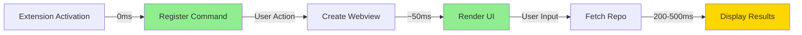

# Building a Git Repository Browser Webview for VS Code Extensions

## Table of Contents
1. [Introduction](#introduction)
2. [Analogy: The Remote Control Panel](#analogy)
3. [Core Concepts](#core-concepts)
4. [Architecture Overview](#architecture)
5. [Implementation Deep-Dive](#implementation)
6. [Hands-On Examples](#examples)
7. [Summary and Next Steps](#summary)

## Introduction

### Why This Matters
Your cp-ninja extension currently loads skills and agents from local file systems. Adding Git repository integration opens powerful possibilities:
- Share skills across teams via private repos
- Access community skills from public repos
- Version control your custom configurations
- Enable dynamic content updates without extension rebuilds

### What You'll Learn
By the end of this tutorial, you'll understand:
- How VS Code webviews work and why they're sandboxed
- Lazy-loading patterns for optimal performance
- Secure Git repository access with token management
- Integration with cp-ninja's existing skill/agent system

### Prerequisites
- Familiarity with TypeScript and VS Code extension APIs
- Understanding of Git basics
- Knowledge of the cp-ninja codebase (specifically ResourceManager, SkillLoader)

## Analogy: The Remote Control Panel

Think of a webview as a **smart TV remote control panel** embedded in your IDE:

- **The Panel (Webview)**: Displays content in an isolated browser-like environment, just like your TV remote has its own screen
- **The TV (VS Code)**: The main application that hosts the remote
- **The Remote Server (Git Repo)**: Where you fetch the channel listings (skills/agents)
- **Lazy Loading**: Like only loading channel info when you press the Guide button, not when you turn on the TV
- **Security**: The remote can't directly access your TV's internal circuits - all communication goes through defined channels (messages)

## Core Concepts

### 1. VS Code Webview Fundamentals

**What is a Webview?**
A webview is an embedded browser instance within VS Code that runs HTML/CSS/JavaScript in a sandboxed environment.

```typescript
// Webviews are isolated from the extension's Node.js process
const panel = vscode.window.createWebviewPanel(
  'gitRepoBrowser',           // View type identifier
  'Git Repository Browser',    // Panel title
  vscode.ViewColumn.Two,       // Display location
  {
    enableScripts: true,       // Allow JavaScript
    retainContextWhenHidden: true, // Keep state when hidden
    localResourceRoots: []     // Restrict file access
  }
);
```

**Key Characteristics:**
- Runs in separate process (isolation)
- Communicates via message passing
- Can't directly access Node.js APIs or file system
- Content Security Policy (CSP) enforced

### 2. Lazy Loading Pattern



### 3. Git Repository Access Strategies

**Option A: GitHub API** (Recommended for public/private repos)
- No local cloning required
- Works with authentication tokens
- Rate-limited but sufficient for browsing

**Option B: Git Command-Line** (For complex operations)
- Requires git installed
- Can clone/fetch locally
- More resource-intensive

**Option C: MCP GitHub Server** (Already available!)
- Your extension already has access to `mcp_github` tools
- No additional dependencies
- Built-in authentication

## Architecture Overview



### Component Responsibilities

| Component | Purpose |
|-----------|---------|
| **GitRepoWebviewProvider** | Manages webview lifecycle, handles messages |
| **GitRepoFetcher** | Abstracts Git operations (uses MCP GitHub) |
| **RepoConfigManager** | Stores repo URLs, tokens, preferences |
| **SkillImporter** | Converts fetched content to skill format |

## Implementation Deep-Dive

### Step 1: Create the Webview Provider

Create `src/GitRepoWebviewProvider.ts`:

```typescript
import * as vscode from 'vscode';
import { GitRepoFetcher } from './GitRepoFetcher';

export class GitRepoWebviewProvider {
    private static instance: GitRepoWebviewProvider;
    private panel?: vscode.WebviewPanel;
    private disposables: vscode.Disposable[] = [];

    private constructor(
        private readonly extensionUri: vscode.Uri,
        private readonly fetcher: GitRepoFetcher
    ) {}

    public static getInstance(
        extensionUri: vscode.Uri, 
        fetcher: GitRepoFetcher
    ): GitRepoWebviewProvider {
        if (!GitRepoWebviewProvider.instance) {
            GitRepoWebviewProvider.instance = new GitRepoWebviewProvider(
                extensionUri, 
                fetcher
            );
        }
        return GitRepoWebviewProvider.instance;
    }

    // Lazy loading: only create panel when requested
    public show(): void {
        if (this.panel) {
            this.panel.reveal(vscode.ViewColumn.Two);
        } else {
            this.createPanel();
        }
    }

    private createPanel(): void {
        this.panel = vscode.window.createWebviewPanel(
            'cpNinjaGitBrowser',
            'Git Repository Browser',
            vscode.ViewColumn.Two,
            {
                enableScripts: true,
                retainContextWhenHidden: true, // Maintain state
                localResourceRoots: [
                    vscode.Uri.joinPath(this.extensionUri, 'resources')
                ]
            }
        );

        this.panel.webview.html = this.getWebviewContent();
        this.setupMessageHandlers();

        // Cleanup when panel is closed
        this.panel.onDidDispose(() => {
            this.panel = undefined;
            this.disposables.forEach(d => d.dispose());
            this.disposables = [];
        });
    }

    private setupMessageHandlers(): void {
        if (!this.panel) return;

        const messageHandler = this.panel.webview.onDidReceiveMessage(
            async (message) => {
                switch (message.command) {
                    case 'fetchRepo':
                        await this.handleFetchRepo(message.url, message.token);
                        break;
                    case 'importSkill':
                        await this.handleImportSkill(message.skillPath);
                        break;
                    case 'saveConfig':
                        await this.handleSaveConfig(message.config);
                        break;
                }
            }
        );
        this.disposables.push(messageHandler);
    }

    private async handleFetchRepo(url: string, token?: string): Promise<void> {
        try {
            // Show loading state
            this.sendMessage({ command: 'loading', value: true });

            const contents = await this.fetcher.fetchRepoContents(url, token);
            
            // Filter for skills, agents, prompts
            const relevantFiles = this.filterRelevantFiles(contents);

            this.sendMessage({ 
                command: 'displayResults', 
                files: relevantFiles 
            });
        } catch (error) {
            vscode.window.showErrorMessage(
                `Failed to fetch repository: ${error instanceof Error ? error.message : 'Unknown error'}`
            );
            this.sendMessage({ command: 'error', message: String(error) });
        } finally {
            this.sendMessage({ command: 'loading', value: false });
        }
    }

    private filterRelevantFiles(files: any[]): any[] {
        return files.filter(file => {
            const path = file.path.toLowerCase();
            return path.includes('skill') || 
                   path.includes('agent') || 
                   path.includes('prompt') ||
                   path.endsWith('.md');
        });
    }

    private sendMessage(message: any): void {
        this.panel?.webview.postMessage(message);
    }

    private getWebviewContent(): string {
        // See next section for HTML content
        return this.getHtmlContent();
    }
}
```

### Step 2: Implement Git Fetcher with MCP

Create `src/GitRepoFetcher.ts`:

```typescript
import * as vscode from 'vscode';

interface RepoFile {
    name: string;
    path: string;
    type: 'file' | 'dir';
    downloadUrl?: string;
}

export class GitRepoFetcher {
    /**
     * Fetch repository contents using GitHub's MCP server
     * @param repoUrl - Format: "owner/repo" or "https://github.com/owner/repo"
     * @param token - Optional GitHub token for private repos
     */
    async fetchRepoContents(
        repoUrl: string, 
        token?: string
    ): Promise<RepoFile[]> {
        const { owner, repo } = this.parseRepoUrl(repoUrl);

        try {
            // Use MCP GitHub to get directory contents
            // Since we can't directly call MCP from here, we'll use VS Code's
            // Copilot chat API or implement a command bridge
            const files = await this.fetchViaGitHubAPI(owner, repo, token);
            return files;
        } catch (error) {
            throw new Error(
                `Failed to fetch ${owner}/${repo}: ${error instanceof Error ? error.message : 'Unknown error'}`
            );
        }
    }

    private parseRepoUrl(url: string): { owner: string; repo: string } {
        // Handle both formats: "owner/repo" or "https://github.com/owner/repo"
        const match = url.match(/(?:github\.com\/)?([^\/]+)\/([^\/\s]+)/);
        if (!match) {
            throw new Error('Invalid repository URL format');
        }
        return { owner: match[1], repo: match[2].replace('.git', '') };
    }

    private async fetchViaGitHubAPI(
        owner: string, 
        repo: string, 
        token?: string
    ): Promise<RepoFile[]> {
        const baseUrl = 'https://api.github.com';
        const headers: HeadersInit = {
            'Accept': 'application/vnd.github.v3+json',
            'User-Agent': 'cp-ninja-vscode-extension'
        };

        if (token) {
            headers['Authorization'] = `token ${token}`;
        }

        // Fetch root directory
        const response = await fetch(
            `${baseUrl}/repos/${owner}/${repo}/contents`,
            { headers }
        );

        if (!response.ok) {
            throw new Error(`GitHub API error: ${response.statusText}`);
        }

        const data = await response.json();
        return data.map((item: any) => ({
            name: item.name,
            path: item.path,
            type: item.type === 'dir' ? 'dir' : 'file',
            downloadUrl: item.download_url
        }));
    }

    async fetchFileContent(downloadUrl: string): Promise<string> {
        const response = await fetch(downloadUrl);
        if (!response.ok) {
            throw new Error(`Failed to fetch file: ${response.statusText}`);
        }
        return response.text();
    }
}
```

### Step 3: Create Lightweight HTML UI

Add to `GitRepoWebviewProvider.ts`:

```typescript
private getHtmlContent(): string {
    return `<!DOCTYPE html>
    <html lang="en">
    <head>
        <meta charset="UTF-8">
        <meta name="viewport" content="width=device-width, initial-scale=1.0">
        <meta http-equiv="Content-Security-Policy" 
              content="default-src 'none'; 
                       style-src 'unsafe-inline'; 
                       script-src 'unsafe-inline';">
        <title>Git Repository Browser</title>
        <style>
            body {
                font-family: var(--vscode-font-family);
                color: var(--vscode-foreground);
                background-color: var(--vscode-editor-background);
                padding: 20px;
                margin: 0;
            }
            .config-section {
                margin-bottom: 20px;
                padding: 15px;
                background-color: var(--vscode-editor-background);
                border: 1px solid var(--vscode-panel-border);
                border-radius: 4px;
            }
            input {
                width: 100%;
                padding: 8px;
                margin: 8px 0;
                background-color: var(--vscode-input-background);
                color: var(--vscode-input-foreground);
                border: 1px solid var(--vscode-input-border);
                border-radius: 2px;
            }
            button {
                background-color: var(--vscode-button-background);
                color: var(--vscode-button-foreground);
                border: none;
                padding: 8px 16px;
                cursor: pointer;
                border-radius: 2px;
                margin-right: 8px;
            }
            button:hover {
                background-color: var(--vscode-button-hoverBackground);
            }
            .loading {
                display: none;
                text-align: center;
                padding: 20px;
            }
            .results {
                margin-top: 20px;
            }
            .file-item {
                padding: 8px;
                margin: 4px 0;
                background-color: var(--vscode-list-hoverBackground);
                border-radius: 2px;
                cursor: pointer;
                display: flex;
                justify-content: space-between;
                align-items: center;
            }
            .file-item:hover {
                background-color: var(--vscode-list-activeSelectionBackground);
            }
            .icon {
                margin-right: 8px;
            }
        </style>
    </head>
    <body>
        <div class="config-section">
            <h2>Repository Configuration</h2>
            <label for="repoUrl">Repository URL</label>
            <input type="text" 
                   id="repoUrl" 
                   placeholder="owner/repo or https://github.com/owner/repo">
            
            <label for="token">Access Token (Optional)</label>
            <input type="password" 
                   id="token" 
                   placeholder="ghp_xxxxxxxxxxxx">
            
            <button onclick="fetchRepo()">Browse Repository</button>
            <button onclick="saveConfig()">Save Configuration</button>
        </div>

        <div class="loading" id="loading">
            <p>🔄 Fetching repository contents...</p>
        </div>

        <div class="results" id="results"></div>

        <script>
            const vscode = acquireVsCodeApi();

            function fetchRepo() {
                const url = document.getElementById('repoUrl').value;
                const token = document.getElementById('token').value;
                
                if (!url) {
                    alert('Please enter a repository URL');
                    return;
                }

                vscode.postMessage({
                    command: 'fetchRepo',
                    url: url,
                    token: token || undefined
                });
            }

            function saveConfig() {
                const url = document.getElementById('repoUrl').value;
                const token = document.getElementById('token').value;
                
                vscode.postMessage({
                    command: 'saveConfig',
                    config: { url, token }
                });
            }

            function importSkill(path, name) {
                vscode.postMessage({
                    command: 'importSkill',
                    skillPath: path,
                    skillName: name
                });
            }

            // Handle messages from extension
            window.addEventListener('message', event => {
                const message = event.data;
                
                switch (message.command) {
                    case 'loading':
                        document.getElementById('loading').style.display = 
                            message.value ? 'block' : 'none';
                        break;
                    
                    case 'displayResults':
                        displayFiles(message.files);
                        break;
                    
                    case 'error':
                        alert('Error: ' + message.message);
                        break;
                }
            });

            function displayFiles(files) {
                const resultsDiv = document.getElementById('results');
                resultsDiv.innerHTML = '<h3>Found Skills & Agents</h3>';
                
                if (files.length === 0) {
                    resultsDiv.innerHTML += '<p>No skills or agents found.</p>';
                    return;
                }

                files.forEach(file => {
                    const item = document.createElement('div');
                    item.className = 'file-item';
                    
                    const icon = file.type === 'dir' ? '📁' : '📄';
                    item.innerHTML = \`
                        <span>
                            <span class="icon">\${icon}</span>
                            \${file.path}
                        </span>
                        <button onclick="importSkill('\${file.path}', '\${file.name}')">
                            Import
                        </button>
                    \`;
                    
                    resultsDiv.appendChild(item);
                });
            }
        </script>
    </body>
    </html>`;
}
```

### Step 4: Register in Extension

Update `src/extension.ts`:

```typescript
import { GitRepoWebviewProvider } from './GitRepoWebviewProvider';
import { GitRepoFetcher } from './GitRepoFetcher';

export function activate(context: vscode.ExtensionContext) {
    // ... existing code ...

    // Initialize Git repo components (lazy)
    const gitFetcher = new GitRepoFetcher();
    const gitWebviewProvider = GitRepoWebviewProvider.getInstance(
        context.extensionUri,
        gitFetcher
    );

    // Register command
    const browseRepoCommand = vscode.commands.registerCommand(
        'cpNinja.browseGitRepo',
        () => gitWebviewProvider.show()
    );
    context.subscriptions.push(browseRepoCommand);
}
```

### Step 5: Add Configuration Storage

Create `src/RepoConfigManager.ts`:

```typescript
import * as vscode from 'vscode';

interface RepoConfig {
    url: string;
    token?: string;
    lastFetched?: Date;
}

export class RepoConfigManager {
    private readonly STORAGE_KEY = 'cpNinja.gitRepos';

    constructor(private readonly context: vscode.ExtensionContext) {}

    async saveRepoConfig(config: RepoConfig): Promise<void> {
        const existing = await this.getAllConfigs();
        
        // Update or add
        const index = existing.findIndex(c => c.url === config.url);
        if (index >= 0) {
            existing[index] = { ...existing[index], ...config };
        } else {
            existing.push(config);
        }

        await this.context.globalState.update(this.STORAGE_KEY, existing);
        vscode.window.showInformationMessage('Repository configuration saved');
    }

    async getAllConfigs(): Promise<RepoConfig[]> {
        return this.context.globalState.get<RepoConfig[]>(this.STORAGE_KEY, []);
    }

    async getRecentConfig(): Promise<RepoConfig | undefined> {
        const configs = await this.getAllConfigs();
        return configs[configs.length - 1];
    }

    async deleteConfig(url: string): Promise<void> {
        const existing = await this.getAllConfigs();
        const filtered = existing.filter(c => c.url !== url);
        await this.context.globalState.update(this.STORAGE_KEY, filtered);
    }
}
```

## Hands-On Examples

### Example 1: Loading Skills from a Public Repo

```typescript
// User enters: "microsoft/vscode-extension-samples"
// System calls:
const files = await fetcher.fetchRepoContents(
    'microsoft/vscode-extension-samples'
);

// Filter results:
const skillFiles = files.filter(f => 
    f.path.includes('skills') || f.name.endsWith('.skill.md')
);

// Display in webview with import buttons
```

**You should see**: A list of markdown files with import buttons next to each.

### Example 2: Importing a Skill

```typescript
private async handleImportSkill(skillPath: string): Promise<void> {
    try {
        // 1. Fetch file content
        const content = await this.fetcher.fetchFileContent(skillPath);
        
        // 2. Parse and validate
        const parsed = this.parseSkillContent(content);
        
        // 3. Save to personal skills directory
        const personalPath = vscode.workspace
            .getConfiguration('cpNinja')
            .get<string>('personalSkillsDirectory');
        
        const targetPath = path.join(
            personalPath,
            parsed.name,
            'SKILL.md'
        );
        
        await fs.promises.mkdir(path.dirname(targetPath), { recursive: true });
        await fs.promises.writeFile(targetPath, content, 'utf-8');
        
        // 4. Register with DynamicSkillRegistry
        await vscode.commands.executeCommand('cpNinja.refreshSkills');
        
        vscode.window.showInformationMessage(
            `Skill "${parsed.name}" imported successfully!`
        );
    } catch (error) {
        vscode.window.showErrorMessage(
            `Import failed: ${error instanceof Error ? error.message : 'Unknown error'}`
        );
    }
}

private parseSkillContent(content: string): { name: string; description: string } {
    const frontmatterMatch = content.match(/^---\n([\s\S]*?)\n---/);
    if (!frontmatterMatch) {
        throw new Error('Invalid skill format: missing frontmatter');
    }
    
    const nameMatch = frontmatterMatch[1].match(/name:\s*(.+)/);
    const descMatch = frontmatterMatch[1].match(/description:\s*"?(.+?)"?$/m);
    
    return {
        name: nameMatch?.[1].trim() || 'unnamed-skill',
        description: descMatch?.[1].trim() || ''
    };
}
```

### Example 3: Using with Private Repos

```typescript
// Store token securely
import * as keytar from 'keytar';

export class SecureTokenStorage {
    private readonly SERVICE = 'cp-ninja';
    private readonly ACCOUNT = 'github-token';

    async storeToken(token: string): Promise<void> {
        await keytar.setPassword(this.SERVICE, this.ACCOUNT, token);
    }

    async getToken(): Promise<string | null> {
        return await keytar.getPassword(this.SERVICE, this.ACCOUNT);
    }

    async deleteToken(): Promise<boolean> {
        return await keytar.deletePassword(this.SERVICE, this.ACCOUNT);
    }
}
```

**Note**: Add `keytar` to dependencies for secure token storage:
```bash
npm install keytar
```

## Summary and Next Steps

### Key Takeaways

✅ **Lazy Loading**: Webview only creates when user requests it
✅ **Security**: Tokens stored securely, CSP enforced
✅ **Lightweight**: Minimal HTML/CSS, no frameworks needed
✅ **Integration**: Works with existing cp-ninja skill system

### Performance Characteristics



### Next Steps

1. **Add Caching**: Cache repo contents to reduce API calls
   ```typescript
   private cache = new Map<string, { data: any[], expires: Date }>();
   ```

2. **Support Subdirectories**: Allow browsing nested folder structures

3. **Batch Import**: Let users select multiple skills to import at once

4. **Auto-Update**: Check for skill updates periodically

5. **Search & Filter**: Add search bar to filter displayed files

### Related Topics
- [VS Code Webview API Documentation](https://code.visualstudio.com/api/extension-guides/webview)
- [GitHub REST API](https://docs.github.com/en/rest)
- [cp-ninja DynamicSkillRegistry](src/DynamicSkillRegistry.ts)

### Common Pitfalls

❌ **Don't**: Create webview on every command invocation
✅ **Do**: Use singleton pattern with lazy initialization

❌ **Don't**: Store tokens in plain text configuration
✅ **Do**: Use VS Code's SecretStorage or keytar

❌ **Don't**: Block extension activation with heavy operations
✅ **Do**: Defer all Git operations until user interaction
