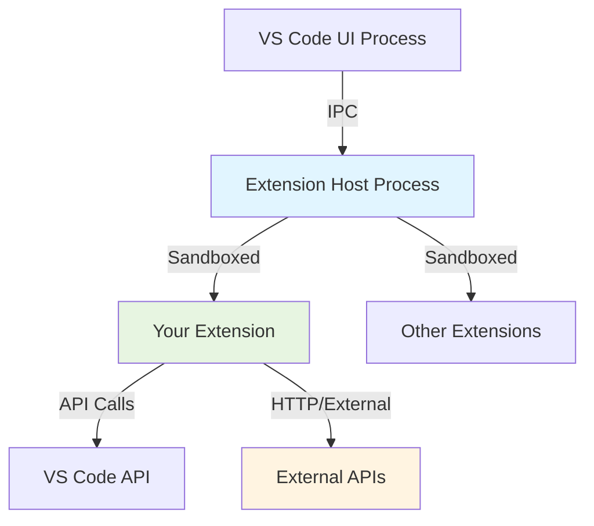
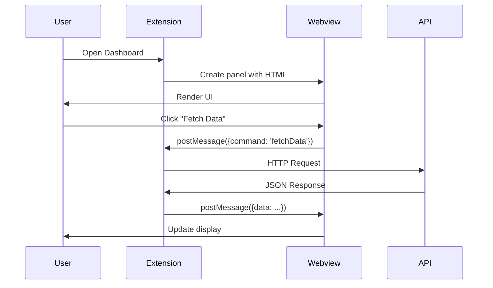
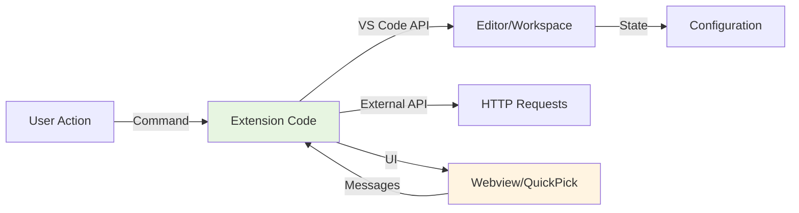

# VS Code Extension Development: From Setup to Advanced Features

## Table of Contents
1. [Introduction](#introduction)
2. [Analogy: Building a Toolbox](#analogy)
3. [Core Concepts](#core-concepts)
4. [Development Environment Setup](#setup)
5. [Simple Extension: Hello World](#simple-extension)
6. [API-Calling Extension: Weather Info](#api-extension)
7. [Webview Extension: Interactive Dashboard](#webview-extension)
8. [Testing and Debugging](#testing)
9. [Publishing Your Extension](#publishing)
10. [Summary and Next Steps](#summary)

## Introduction

### Why Build VS Code Extensions?
VS Code's extension ecosystem is one of its greatest strengths, allowing developers to:
- Automate repetitive tasks and workflows
- Integrate external tools and services
- Create custom UI components and views
- Enhance coding productivity with specialized features

### What You'll Learn
By the end of this tutorial, you'll know how to:
- Set up a professional VS Code extension development environment
- Build a simple command-based extension
- Create extensions that call external APIs
- Implement interactive webviews
- Test, debug, and publish your extensions

### Prerequisites
- Basic knowledge of TypeScript/JavaScript
- Node.js and npm installed (LTS version recommended)
- VS Code installed
- Familiarity with command-line tools

## Analogy: Building a Toolbox

Think of VS Code extension development as **building custom tools for your workshop**:

- **The Workshop (VS Code)**: Your main work environment
- **The Toolbox API (VS Code Extension API)**: Pre-built components you can use (like buying tool handles, screws, etc.)
- **Simple Extensions (Hand Tools)**: Basic commands that do one thing well, like a screwdriver
- **API Extensions (Power Tools)**: Tools that connect to external power sources (APIs) to do more complex work
- **Webviews (Digital Displays)**: Interactive panels that show information and accept input
- **Extension Host (Tool Safety)**: A separate process that keeps your tools from breaking the main workshop

## Core Concepts

### 1. Extension Anatomy

Every VS Code extension has these key components:

```
my-extension/
├── package.json          # Extension manifest (what it does, commands, etc.)
├── tsconfig.json         # TypeScript configuration
├── src/
│   └── extension.ts      # Main entry point
├── out/                  # Compiled JavaScript (generated)
└── node_modules/         # Dependencies
```

**package.json** is the heart of your extension:
```json
{
  "name": "my-extension",
  "displayName": "My Extension",
  "version": "1.0.0",
  "engines": {
    "vscode": "^1.85.0"
  },
  "main": "./out/extension.js",
  "activationEvents": ["onCommand:my-extension.hello"],
  "contributes": {
    "commands": [{
      "command": "my-extension.hello",
      "title": "Say Hello"
    }]
  }
}
```

### 2. Activation Events

Extensions activate (start running) based on triggers:

| Event | When It Fires |
|-------|---------------|
| `onCommand:commandId` | When user runs a specific command |
| `onLanguage:python` | When user opens a Python file |
| `onView:viewId` | When a custom view becomes visible |
| `onStartupFinished` | After VS Code fully loads (recommended for background tasks) |
| `*` | Immediately on startup (use sparingly - impacts performance) |

### 3. The Extension Host Process



**Key Points**:
- Extensions run in a separate process for stability
- Your extension can't crash VS Code itself
- Communication happens via VS Code API
- Direct DOM access is restricted (use webviews)

### 4. VS Code API Categories

The API is organized into logical modules:

```typescript
import * as vscode from 'vscode';

// Window interactions
vscode.window.showInformationMessage('Hello!');
vscode.window.createWebviewPanel(...);

// Workspace operations
vscode.workspace.workspaceFolders;
vscode.workspace.findFiles(...);

// Editor manipulations
vscode.window.activeTextEditor?.edit(...);

// Language features
vscode.languages.registerCompletionItemProvider(...);

// Commands
vscode.commands.registerCommand(...);
```

## Development Environment Setup

### Step 1: Install Required Tools

```bash
# Verify Node.js installation (v18+ recommended)
node --version
npm --version

# Install Yeoman and VS Code Extension Generator
npm install -g yo generator-code

# Install VS Code Extension CLI (optional, for publishing)
npm install -g @vscode/vsce
```

### Step 2: Create Your First Extension

```bash
# Run the generator
yo code

# You'll be prompted:
# ? What type of extension? → New Extension (TypeScript)
# ? Extension name? → my-first-extension
# ? Description? → My first VS Code extension
# ? Initialize git? → Yes
# ? Package manager? → npm

# Navigate to the extension directory
cd my-first-extension

# Install dependencies
npm install
```

### Step 3: Understanding the Generated Structure

Now let's examine what the generator created. The heart of every VS Code extension is the `extension.ts` file, which acts as the entry point. Think of it as the "main()" function of your extension.

This file exports two critical functions:
- **`activate()`**: Called when your extension starts up (based on activation events)
- **`deactivate()`**: Called when your extension shuts down (for cleanup)

Here's what the generated code looks like:

```typescript
// src/extension.ts - The main entry point
import * as vscode from 'vscode';

// Called when extension activates
export function activate(context: vscode.ExtensionContext) {
    console.log('Extension is now active!');
    
    // Register command - this connects your command ID to the actual function
    // The first parameter matches the command ID in package.json
    // The second parameter is the function that executes when the command runs
    const disposable = vscode.commands.registerCommand(
        'my-first-extension.helloWorld',
        () => {
            vscode.window.showInformationMessage(
                'Hello World from my-first-extension!'
            );
        }
    );
    
    // IMPORTANT: Always add disposables to subscriptions
    // This ensures proper cleanup when the extension deactivates
    context.subscriptions.push(disposable);
}

// Called when extension deactivates
// Use this for cleanup: close connections, save state, dispose resources
export function deactivate() {}
```

### Step 4: Running Your Extension

1. **Open the extension folder** in VS Code
2. **Press F5** to launch Extension Development Host
3. **In the new window**, open Command Palette (Cmd/Ctrl+Shift+P)
4. **Type and run**: "Hello World"

**You should see**: A message "Hello World from my-first-extension!"

### Step 5: Setting Up TypeScript Compiler

```bash
# Watch mode - auto-compile on save
npm run watch

# Or manually compile
npm run compile
```

## Simple Extension: Hello World++

Let's enhance the basic extension with more features. We'll add three different commands to demonstrate common patterns:

1. **Dynamic greetings** - Reading from configuration settings
2. **Editor manipulation** - Inserting text at the cursor position
3. **Document analysis** - Reading and analyzing the active file

Each command showcases a different aspect of the VS Code API. Notice how we check for the active editor's existence before operating on it - this prevents errors when no file is open.

### Enhanced Extension with Multiple Commands

```typescript
// src/extension.ts
import * as vscode from 'vscode';

export function activate(context: vscode.ExtensionContext) {
    // Command 1: Show greeting
    const helloCommand = vscode.commands.registerCommand(
        'myext.hello',
        () => {
            // Read from user's settings (workspace or global)
            // The second parameter 'World' is the default fallback value
            const name = vscode.workspace
                .getConfiguration('myext')
                .get('userName', 'World');
            
            vscode.window.showInformationMessage(`Hello, ${name}!`);
        }
    );

    // Command 2: Insert text at cursor
    const insertDateCommand = vscode.commands.registerCommand(
        'myext.insertDate',
        () => {
            const editor = vscode.window.activeTextEditor;
            if (!editor) {
                vscode.window.showWarningMessage('No active editor');
                return;
            }

            const date = new Date().toLocaleDateString();
            editor.edit(editBuilder => {
                editBuilder.insert(editor.selection.active, date);
            });
        }
    );

    // Command 3: Count lines in active file
    const countLinesCommand = vscode.commands.registerCommand(
        'myext.countLines',
        () => {
            const editor = vscode.window.activeTextEditor;
            if (!editor) {
                vscode.window.showWarningMessage('No active editor');
                return;
            }

            const lineCount = editor.document.lineCount;
            const selection = editor.selection;
            const selectedLines = selection.end.line - selection.start.line + 1;

            vscode.window.showInformationMessage(
                `Total lines: ${lineCount} | Selected: ${selectedLines}`
            );
        }
    );

    context.subscriptions.push(
        helloCommand,
        insertDateCommand,
        countLinesCommand
    );
}

export function deactivate() {}
```

### Update package.json

```json
{
  "contributes": {
    "commands": [
      {
        "command": "myext.hello",
        "title": "My Extension: Say Hello"
      },
      {
        "command": "myext.insertDate",
        "title": "My Extension: Insert Current Date"
      },
      {
        "command": "myext.countLines",
        "title": "My Extension: Count Lines"
      }
    ],
    "configuration": {
      "title": "My Extension",
      "properties": {
        "myext.userName": {
          "type": "string",
          "default": "World",
          "description": "Your name for greetings"
        }
      }
    },
    "keybindings": [
      {
        "command": "myext.insertDate",
        "key": "ctrl+shift+d",
        "mac": "cmd+shift+d",
        "when": "editorTextFocus"
      }
    ]
  }
}
```

## API-Calling Extension: Weather Info

Now let's level up and build an extension that communicates with the outside world. This example demonstrates:
- Making HTTP requests to external APIs
- Handling asynchronous operations
- Managing API keys securely through settings
- Displaying progress indicators to users

We'll use OpenWeatherMap's free API (you can get a key at openweathermap.org). The pattern shown here works for any REST API.

### Step 1: Create the Weather Provider

First, we'll create a separate class to handle API communication. This separation of concerns makes the code more maintainable and testable.

```typescript
// src/weatherProvider.ts
import * as https from 'https';

export interface WeatherData {
    location: string;
    temperature: number;
    description: string;
    humidity: number;
}

export class WeatherProvider {
    private apiKey: string;

    constructor(apiKey: string) {
        this.apiKey = apiKey;
    }

    async getWeather(city: string): Promise<WeatherData> {
        return new Promise((resolve, reject) => {
            // Construct the API URL with query parameters
            // We use template literals for clean string interpolation
            // units=metric gives us Celsius instead of Kelvin
            const url = `https://api.openweathermap.org/data/2.5/weather?q=${city}&appid=${this.apiKey}&units=metric`;

            https.get(url, (res) => {
                let data = '';

                res.on('data', (chunk) => {
                    data += chunk;
                });

                res.on('end', () => {
                    try {
                        const json = JSON.parse(data);
                        
                        if (json.cod !== 200) {
                            reject(new Error(json.message || 'Weather fetch failed'));
                            return;
                        }

                        resolve({
                            location: json.name,
                            temperature: json.main.temp,
                            description: json.weather[0].description,
                            humidity: json.main.humidity
                        });
                    } catch (error) {
                        reject(error);
                    }
                });
            }).on('error', (error) => {
                reject(error);
            });
        });
    }
}
```

### Step 2: Integrate with Extension

```typescript
// src/extension.ts
import * as vscode from 'vscode';
import { WeatherProvider } from './weatherProvider';

export function activate(context: vscode.ExtensionContext) {
    let weatherProvider: WeatherProvider | null = null;

    // Command to check weather
    const checkWeatherCommand = vscode.commands.registerCommand(
        'weatherext.checkWeather',
        async () => {
            // Get API key from settings
            const apiKey = vscode.workspace
                .getConfiguration('weatherext')
                .get<string>('apiKey');

            if (!apiKey) {
                const response = await vscode.window.showErrorMessage(
                    'Weather API key not configured',
                    'Configure Now'
                );
                
                if (response === 'Configure Now') {
                    vscode.commands.executeCommand(
                        'workbench.action.openSettings',
                        'weatherext.apiKey'
                    );
                }
                return;
            }

            // Prompt for city
            const city = await vscode.window.showInputBox({
                prompt: 'Enter city name',
                placeHolder: 'e.g., London, Tokyo, New York'
            });

            if (!city) {
                return;
            }

            // Show progress
            await vscode.window.withProgress(
                {
                    location: vscode.ProgressLocation.Notification,
                    title: `Fetching weather for ${city}...`,
                    cancellable: false
                },
                async (progress) => {
                    try {
                        if (!weatherProvider) {
                            weatherProvider = new WeatherProvider(apiKey);
                        }

                        const weather = await weatherProvider.getWeather(city);

                        // Display results
                        const message = `
                            📍 ${weather.location}
                            🌡️ ${weather.temperature}°C
                            ☁️ ${weather.description}
                            💧 Humidity: ${weather.humidity}%
                        `.trim().replace(/\s+/g, ' ');

                        vscode.window.showInformationMessage(message);
                    } catch (error) {
                        vscode.window.showErrorMessage(
                            `Failed to fetch weather: ${error instanceof Error ? error.message : 'Unknown error'}`
                        );
                    }
                }
            );
        }
    );

    context.subscriptions.push(checkWeatherCommand);
}

export function deactivate() {}
```

### Step 3: Add Configuration

```json
// package.json
{
  "contributes": {
    "commands": [
      {
        "command": "weatherext.checkWeather",
        "title": "Weather: Check Current Weather"
      }
    ],
    "configuration": {
      "title": "Weather Extension",
      "properties": {
        "weatherext.apiKey": {
          "type": "string",
          "default": "",
          "description": "OpenWeatherMap API key (get free at openweathermap.org)"
        }
      }
    }
  }
}
```

### Step 4: Enhanced Error Handling

```typescript
// src/errorHandler.ts
import * as vscode from 'vscode';

export class ErrorHandler {
    static handle(error: unknown, context?: string): void {
        const message = error instanceof Error ? error.message : 'Unknown error';
        const fullMessage = context ? `${context}: ${message}` : message;

        console.error(fullMessage, error);
        
        vscode.window.showErrorMessage(fullMessage, 'View Logs').then(action => {
            if (action === 'View Logs') {
                vscode.commands.executeCommand('workbench.action.showLogs');
            }
        });
    }

    static async withErrorHandling<T>(
        fn: () => Promise<T>,
        context?: string
    ): Promise<T | undefined> {
        try {
            return await fn();
        } catch (error) {
            this.handle(error, context);
            return undefined;
        }
    }
}
```

## Webview Extension: Interactive Dashboard

Webviews are where VS Code extensions truly shine. They allow you to create rich, interactive UIs using familiar web technologies (HTML, CSS, JavaScript) while remaining sandboxed for security.

**Key Concepts**:
- Webviews run in a separate iframe-like context
- Communication happens via message passing (like web workers)
- You can style using VS Code's CSS variables for theme consistency
- Content Security Policy (CSP) protects against XSS attacks

Let's build a dashboard that displays project statistics with real-time updates.

### Architecture for Webview Extension



### Step 1: Create Dashboard Provider

```typescript
// src/dashboardProvider.ts
import * as vscode from 'vscode';

export class DashboardProvider {
    private static instance: DashboardProvider | undefined;
    private panel: vscode.WebviewPanel | undefined;

    private constructor(
        private readonly extensionUri: vscode.Uri
    ) {}

    // Singleton pattern ensures only one dashboard exists
    // This prevents multiple panels from being created and consuming resources
    public static getInstance(extensionUri: vscode.Uri): DashboardProvider {
        if (!DashboardProvider.instance) {
            DashboardProvider.instance = new DashboardProvider(extensionUri);
        }
        return DashboardProvider.instance;
    }

    public show(): void {
        if (this.panel) {
            this.panel.reveal(vscode.ViewColumn.One);
        } else {
            this.createPanel();
        }
    }

    private createPanel(): void {
        this.panel = vscode.window.createWebviewPanel(
            'dashboard',
            'My Dashboard',
            vscode.ViewColumn.One,
            {
                enableScripts: true,
                retainContextWhenHidden: true,
                localResourceRoots: [
                    vscode.Uri.joinPath(this.extensionUri, 'media')
                ]
            }
        );

        this.panel.webview.html = this.getWebviewContent();
        this.setupMessageHandlers();

        this.panel.onDidDispose(() => {
            this.panel = undefined;
        });
    }

    private setupMessageHandlers(): void {
        // This is the bridge between webview and extension
        // Webview sends messages via postMessage, we handle them here
        this.panel?.webview.onDidReceiveMessage(
            async (message) => {
                // Use a switch to handle different command types
                switch (message.command) {
                    case 'alert':
                        vscode.window.showInformationMessage(message.text);
                        break;

                    case 'fetchData':
                        await this.handleFetchData();
                        break;

                    case 'saveSettings':
                        await this.handleSaveSettings(message.settings);
                        break;
                }
            }
        );
    }

    private async handleFetchData(): Promise<void> {
        try {
            // Simulate API call
            await new Promise(resolve => setTimeout(resolve, 1000));
            
            const data = {
                projects: 12,
                tasks: 45,
                completed: 38,
                pending: 7
            };

            this.panel?.webview.postMessage({
                command: 'updateData',
                data: data
            });
        } catch (error) {
            this.panel?.webview.postMessage({
                command: 'error',
                message: 'Failed to fetch data'
            });
        }
    }

    private async handleSaveSettings(settings: any): Promise<void> {
        const config = vscode.workspace.getConfiguration('dashboard');
        await config.update('theme', settings.theme, vscode.ConfigurationTarget.Global);
        
        vscode.window.showInformationMessage('Settings saved!');
    }

    private getWebviewContent(): string {
        return `<!DOCTYPE html>
        <html lang="en">
        <head>
            <meta charset="UTF-8">
            <meta name="viewport" content="width=device-width, initial-scale=1.0">
            <meta http-equiv="Content-Security-Policy" 
                  content="default-src 'none'; 
                           style-src 'unsafe-inline' ${this.panel?.webview.cspSource}; 
                           script-src 'unsafe-inline' ${this.panel?.webview.cspSource};">
            <title>Dashboard</title>
            <style>
                * {
                    margin: 0;
                    padding: 0;
                    box-sizing: border-box;
                }
                
                body {
                    font-family: var(--vscode-font-family);
                    color: var(--vscode-foreground);
                    background-color: var(--vscode-editor-background);
                    padding: 20px;
                }
                
                h1 {
                    margin-bottom: 20px;
                    color: var(--vscode-textLink-foreground);
                }
                
                .stats-grid {
                    display: grid;
                    grid-template-columns: repeat(auto-fit, minmax(200px, 1fr));
                    gap: 20px;
                    margin-bottom: 30px;
                }
                
                .stat-card {
                    background: var(--vscode-editor-background);
                    border: 1px solid var(--vscode-panel-border);
                    border-radius: 8px;
                    padding: 20px;
                    text-align: center;
                }
                
                .stat-value {
                    font-size: 2.5em;
                    font-weight: bold;
                    color: var(--vscode-textLink-activeForeground);
                }
                
                .stat-label {
                    margin-top: 10px;
                    opacity: 0.8;
                }
                
                .controls {
                    display: flex;
                    gap: 10px;
                    margin-bottom: 20px;
                }
                
                button {
                    background-color: var(--vscode-button-background);
                    color: var(--vscode-button-foreground);
                    border: none;
                    padding: 10px 20px;
                    cursor: pointer;
                    border-radius: 4px;
                    font-size: 14px;
                }
                
                button:hover {
                    background-color: var(--vscode-button-hoverBackground);
                }
                
                button:disabled {
                    opacity: 0.5;
                    cursor: not-allowed;
                }
                
                .loading {
                    display: none;
                    text-align: center;
                    padding: 20px;
                    color: var(--vscode-descriptionForeground);
                }
                
                .loading.active {
                    display: block;
                }
                
                select {
                    background-color: var(--vscode-dropdown-background);
                    color: var(--vscode-dropdown-foreground);
                    border: 1px solid var(--vscode-dropdown-border);
                    padding: 8px;
                    border-radius: 4px;
                }
            </style>
        </head>
        <body>
            <h1>📊 Project Dashboard</h1>
            
            <div class="controls">
                <button id="fetchBtn">Refresh Data</button>
                <select id="themeSelect">
                    <option value="default">Default Theme</option>
                    <option value="dark">Dark Theme</option>
                    <option value="light">Light Theme</option>
                </select>
                <button id="saveBtn">Save Settings</button>
            </div>
            
            <div class="loading" id="loading">
                <p>⏳ Loading data...</p>
            </div>
            
            <div class="stats-grid">
                <div class="stat-card">
                    <div class="stat-value" id="projects">0</div>
                    <div class="stat-label">Projects</div>
                </div>
                <div class="stat-card">
                    <div class="stat-value" id="tasks">0</div>
                    <div class="stat-label">Total Tasks</div>
                </div>
                <div class="stat-card">
                    <div class="stat-value" id="completed">0</div>
                    <div class="stat-label">Completed</div>
                </div>
                <div class="stat-card">
                    <div class="stat-value" id="pending">0</div>
                    <div class="stat-label">Pending</div>
                </div>
            </div>

            <script>
                const vscode = acquireVsCodeApi();
                
                // DOM elements
                const fetchBtn = document.getElementById('fetchBtn');
                const saveBtn = document.getElementById('saveBtn');
                const themeSelect = document.getElementById('themeSelect');
                const loading = document.getElementById('loading');
                
                // Event listeners
                fetchBtn.addEventListener('click', () => {
                    loading.classList.add('active');
                    fetchBtn.disabled = true;
                    
                    vscode.postMessage({
                        command: 'fetchData'
                    });
                });
                
                saveBtn.addEventListener('click', () => {
                    vscode.postMessage({
                        command: 'saveSettings',
                        settings: {
                            theme: themeSelect.value
                        }
                    });
                });
                
                // Handle messages from extension
                window.addEventListener('message', event => {
                    const message = event.data;
                    
                    switch (message.command) {
                        case 'updateData':
                            updateStats(message.data);
                            loading.classList.remove('active');
                            fetchBtn.disabled = false;
                            break;
                            
                        case 'error':
                            vscode.postMessage({
                                command: 'alert',
                                text: message.message
                            });
                            loading.classList.remove('active');
                            fetchBtn.disabled = false;
                            break;
                    }
                });
                
                function updateStats(data) {
                    document.getElementById('projects').textContent = data.projects;
                    document.getElementById('tasks').textContent = data.tasks;
                    document.getElementById('completed').textContent = data.completed;
                    document.getElementById('pending').textContent = data.pending;
                }
                
                // Auto-fetch on load
                setTimeout(() => fetchBtn.click(), 500);
            </script>
        </body>
        </html>`;
    }
}
```

### Step 2: Register in Extension

```typescript
// src/extension.ts
import * as vscode from 'vscode';
import { DashboardProvider } from './dashboardProvider';

export function activate(context: vscode.ExtensionContext) {
    const dashboardProvider = DashboardProvider.getInstance(context.extensionUri);

    const showDashboardCommand = vscode.commands.registerCommand(
        'myext.showDashboard',
        () => dashboardProvider.show()
    );

    context.subscriptions.push(showDashboardCommand);
}

export function deactivate() {}
```

### Step 3: Add to package.json

```json
{
  "contributes": {
    "commands": [
      {
        "command": "myext.showDashboard",
        "title": "My Extension: Show Dashboard",
        "icon": "$(dashboard)"
      }
    ]
  }
}
```

## Testing and Debugging

### Unit Testing with Jest

```bash
# Install testing dependencies
npm install --save-dev @types/jest jest ts-jest @types/vscode
```

```typescript
// src/weatherProvider.test.ts
import { WeatherProvider } from './weatherProvider';

describe('WeatherProvider', () => {
    let provider: WeatherProvider;

    beforeEach(() => {
        provider = new WeatherProvider('test-api-key');
    });

    test('should parse weather data correctly', async () => {
        // Mock implementation
        const mockData = {
            location: 'London',
            temperature: 20,
            description: 'Clear sky',
            humidity: 65
        };

        // Test your logic
        expect(mockData.temperature).toBeGreaterThan(0);
        expect(mockData.location).toBe('London');
    });
});
```

### Debugging Configuration

```json
// .vscode/launch.json
{
    "version": "0.2.0",
    "configurations": [
        {
            "name": "Run Extension",
            "type": "extensionHost",
            "request": "launch",
            "args": [
                "--extensionDevelopmentPath=${workspaceFolder}"
            ],
            "outFiles": [
                "${workspaceFolder}/out/**/*.js"
            ],
            "preLaunchTask": "${defaultBuildTask}"
        },
        {
            "name": "Extension Tests",
            "type": "extensionHost",
            "request": "launch",
            "args": [
                "--extensionDevelopmentPath=${workspaceFolder}",
                "--extensionTestsPath=${workspaceFolder}/out/test/suite/index"
            ],
            "outFiles": [
                "${workspaceFolder}/out/test/**/*.js"
            ],
            "preLaunchTask": "${defaultBuildTask}"
        }
    ]
}
```

### Debugging Tips

```typescript
// Use VS Code's output channel for logging
const outputChannel = vscode.window.createOutputChannel('My Extension');

outputChannel.appendLine('Extension activated');
outputChannel.appendLine(`API Key: ${apiKey ? '***' : 'not set'}`);
outputChannel.show(); // Show the output panel

// Use console for debugging (appears in Debug Console)
console.log('Debug info:', data);
console.error('Error occurred:', error);

// Add breakpoints in TypeScript files
debugger; // Execution will pause here when debugging
```

## Publishing Your Extension

### Step 1: Prepare for Publishing

```json
// package.json - Update metadata
{
  "name": "my-extension",
  "displayName": "My Awesome Extension",
  "description": "A detailed description of what your extension does",
  "version": "1.0.0",
  "publisher": "your-publisher-name",
  "repository": {
    "type": "git",
    "url": "https://github.com/yourusername/your-extension"
  },
  "keywords": [
    "productivity",
    "weather",
    "dashboard"
  ],
  "categories": [
    "Other"
  ],
  "icon": "images/icon.png",
  "license": "MIT"
}
```

### Step 2: Create Publisher Account

1. Visit [Visual Studio Marketplace](https://marketplace.visualstudio.com/manage)
2. Sign in with Microsoft account
3. Create a new publisher ID
4. Generate a Personal Access Token (PAT)

### Step 3: Package Extension

```bash
# Install vsce if not already installed
npm install -g @vscode/vsce

# Package the extension (creates .vsix file)
vsce package

# You should see: my-extension-1.0.0.vsix
```

### Step 4: Publish to Marketplace

```bash
# Login with your publisher account
vsce login your-publisher-name

# Publish the extension
vsce publish

# Or publish with version bump
vsce publish minor  # 1.0.0 -> 1.1.0
vsce publish patch  # 1.0.0 -> 1.0.1
vsce publish major  # 1.0.0 -> 2.0.0
```

### Step 5: Install Your Published Extension

```bash
# Install from .vsix file (local testing)
code --install-extension my-extension-1.0.0.vsix

# Or users can install from Marketplace
# Search for "My Awesome Extension" in VS Code extensions
```

## Summary and Next Steps

### Key Takeaways

✅ **Setup**: Yo Code generator provides perfect starter template  
✅ **Simple Extensions**: Commands are registered via `vscode.commands.registerCommand()`  
✅ **API Extensions**: Use native Node.js modules (https, fs) or npm packages  
✅ **Webviews**: Isolated HTML/CSS/JS with message passing for communication  
✅ **Testing**: Jest for unit tests, F5 for integration testing  
✅ **Publishing**: vsce packages and publishes to marketplace  

### Extension Development Patterns



### Common Pitfalls

❌ **Don't**: Use `activationEvents: ["*"]` unless absolutely necessary  
✅ **Do**: Use specific activation events or `onStartupFinished`

❌ **Don't**: Store sensitive data in workspace settings  
✅ **Do**: Use `context.secrets` for API keys and tokens

❌ **Don't**: Directly manipulate DOM in extension code  
✅ **Do**: Use webviews for custom UI

❌ **Don't**: Make synchronous blocking calls  
✅ **Do**: Use async/await for all I/O operations

### Next Steps

1. **Tree Views**: Create custom sidebar views
   ```typescript
   vscode.window.registerTreeDataProvider('myView', treeDataProvider);
   ```

2. **Language Features**: Add IntelliSense, hover info, diagnostics
   ```typescript
   vscode.languages.registerCompletionItemProvider('python', provider);
   ```

3. **Status Bar Items**: Show persistent information
   ```typescript
   const statusBar = vscode.window.createStatusBarItem();
   statusBar.text = "$(clock) 10:30";
   statusBar.show();
   ```

4. **Custom Editors**: Build specialized editors for file types
   ```typescript
   vscode.window.registerCustomEditorProvider(viewType, provider);
   ```

5. **Terminal Integration**: Create and manage integrated terminals
   ```typescript
   const terminal = vscode.window.createTerminal('My Terminal');
   terminal.sendText('echo "Hello"');
   ```

### Resources

- [VS Code Extension API](https://code.visualstudio.com/api)
- [Extension Samples Repository](https://github.com/microsoft/vscode-extension-samples)
- [Extension Guidelines](https://code.visualstudio.com/api/references/extension-guidelines)
- [Publishing Extensions](https://code.visualstudio.com/api/working-with-extensions/publishing-extension)

### Example Project Structure

```
my-production-extension/
├── .vscode/
│   ├── launch.json
│   └── tasks.json
├── src/
│   ├── extension.ts           # Main entry
│   ├── commands/
│   │   ├── helloCommand.ts
│   │   └── dashboardCommand.ts
│   ├── providers/
│   │   ├── weatherProvider.ts
│   │   └── dashboardProvider.ts
│   ├── utils/
│   │   ├── errorHandler.ts
│   │   └── logger.ts
│   └── test/
│       └── suite/
│           └── extension.test.ts
├── media/
│   ├── styles.css
│   └── icon.png
├── resources/
│   └── templates/
├── out/                        # Compiled JS
├── .vscodeignore
├── package.json
├── tsconfig.json
└── README.md
```

---

**Congratulations!** You now have the knowledge to build VS Code extensions from simple commands to complex webview applications. Start with a simple idea, build iteratively, and publish when ready!

